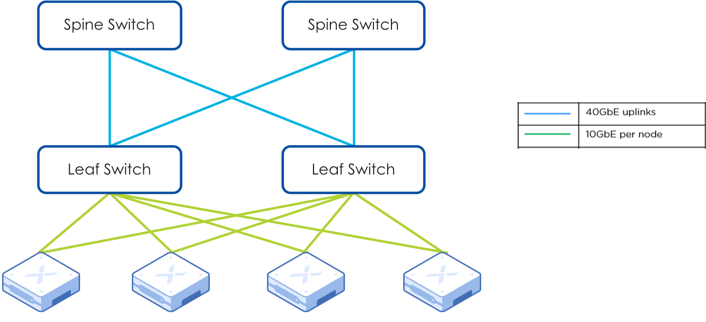
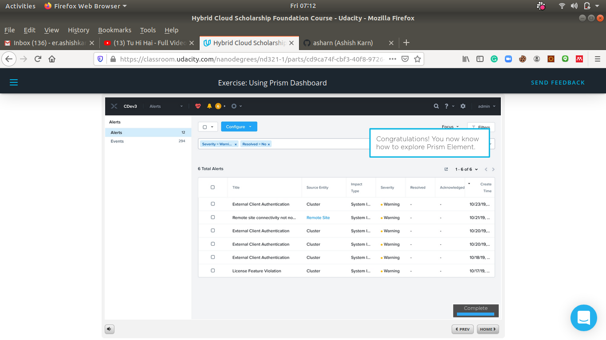
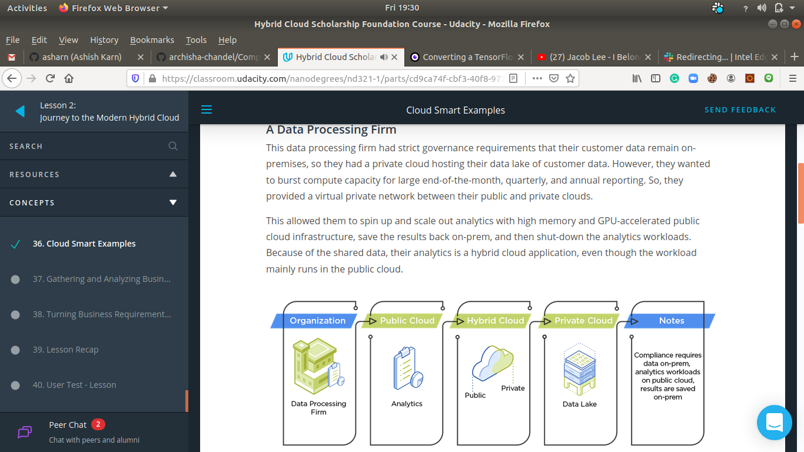

# 2.5-month-of-nutanix-hybrid-cloud-challenge
This repo contains all the information related to Nutanix® Hybrid Cloud Scholarship Program of Phase-I and if selected then of Phase-II as well.

Today, I am able to complete this challenge which takes almost 35 days of dedicated hard work. I personally feel the course content was easy for every one to grasp and learn fast. 
In the whole process, I have learned: \

- How technology evolved over the years to bring us to the hybrid cloud of today.
- Got familiar with the basics of hybrid cloud networking, security, virtual machine management, and data protection.
- Became a little more comfortable with hyperconverged infrastructure and the hybrid cloud itself.

Thanks to Everyone\

Next I will help other to solve their query.

Certificate\

Today Status:\
## Day 35: July 28, 2020. #30DaysofUdacity
- My current progress is:\
  **2. Modern Private Cloud Infrastructure** (Progress 100%)
    - **Lesson 7. Data Protection** (Progress 94%)
		- **Integrated Remote Backup**\
		- **Cloud Backups**
		- **Lesson Recap**\
			- The state of data protection
			- The complexities of data protection in a hybrid cloud world
			- Data protection trends
			- Data protection in the hybrid cloud
			

I will encourage random folks @Patricio.Rojas @Diptesh Sil @J Prem Shanker @shashvat gupta 
											@Mary Becken @Jose Rubio @Christine Rehm @Marco Nogueira 
											@Sudheer Kumar @Anna Brakowska @Leonardo Hideki Ishikiriyama 
											@Rao Kamran @Sandeep Kumar Jha @Chucks @Jorge Luis Rodríguez González 
											@Anshu Trivedi @Omar Bataineh @Mokit Hossain @Ritvik Gupta @masnoon @Vignesh Natarajan 
											@Marco Nogueira @Melissa Bloomer @Ahmad Turay @Oladapo Bolarinwa @Korene Stuart @Isaac Yauri
											@Hung  @xuren71 @Santhosh Kumar  @jatin mittal @Dev Ranjan @Souvik Jana @Rav
											@Jhonatan Nagasako @Christine Rehm @Juan T @Remi @Jaykumar Patel @Quan
											@Wilson @Christian Rivera @SALMAN ZAMAN @Nigel P @Jonathan Blanco @JohnBucMoore
											@LauraT @Serjesh @Nícolas Pauli @Jaskaran Singh @AlabamaRatchet @Al Kuilan @Noel Situ
											@AndyP @Juan T @Jhonatan Nagasako @Isaac Yauri  @Shamli Singh @Marc Kristen
											@Mokit Hossain @Lovepreet Singh @Mariia @Pree  @susyjam @Ashique Bin Iqbal @Iqbal Singh 
											@Lovepreet Singh  @Mitchell Greifeneder @Jiva @Frida @Ali Asim Kazmi @EO4Wellness @Omar
											@Mike McK @Aaron @Aayushi Bhatiya @Abdallah Melloul @Melissa Bloomer @Md. Fahim Foysal
											@Juan T @Prachal Patel @Ashraf Kanyadakam @Romana Akter @Jum @Chris M @Shivani @Ayodeji
											@Alekhya V @Amardeep Singh @Lara Freiria @Abhinav Rastogi @Mahitej
											

## Day 34: July 27, 2020. #30DaysofUdacity
- My current progress is:\
  **2. Modern Private Cloud Infrastructure** (Progress 100%)
    - **Lesson 7. Data Protection** (Progress 94%)
		- **Backups Overview**\
		Regular backups are the second line of defense in data protection, and the only protection against user, administrator, and application errors that result in data being deleted or corrupted. The Nutanix hybrid cloud provides three levels of backup:
			- Converged local backup with snapshots
			- Integrated remote backup
			- Cloud backups
		- **Exercise: Creating Protection Domains/Local VM Restore**
		- **Converged Local Backup with Nutanix Snapshot**

I will encourage random folks @Patricio.Rojas @Diptesh Sil @J Prem Shanker @shashvat gupta 
											@Mary Becken @Jose Rubio @Christine Rehm @Marco Nogueira 
											@Sudheer Kumar @Anna Brakowska @Leonardo Hideki Ishikiriyama 
											@Rao Kamran @Sandeep Kumar Jha @Chucks @Jorge Luis Rodríguez González 
											@Anshu Trivedi @Omar Bataineh @Mokit Hossain @Ritvik Gupta @masnoon @Vignesh Natarajan 
											@Marco Nogueira @Melissa Bloomer @Ahmad Turay @Oladapo Bolarinwa @Korene Stuart @Isaac Yauri
											@Hung  @xuren71 @Santhosh Kumar  @jatin mittal @Dev Ranjan @Souvik Jana @Rav
											@Jhonatan Nagasako @Christine Rehm @Juan T @Remi @Jaykumar Patel @Quan
											@Wilson @Christian Rivera @SALMAN ZAMAN @Nigel P @Jonathan Blanco @JohnBucMoore
											@LauraT @Serjesh @Nícolas Pauli @Jaskaran Singh @AlabamaRatchet @Al Kuilan @Noel Situ
											@AndyP @Juan T @Jhonatan Nagasako @Isaac Yauri  @Shamli Singh @Marc Kristen
											@Rothwulf @Emily Chang @Monisha gali @Oladapo Bolarinwa @Nienke Bos @Sadia 
											@Aaron @Aayushi Bhatiya @Abdallah Melloul @Melissa Bloomer @Md. Fahim Foysal
											

## Day 33: July 26, 2020. #30DaysofUdacity
- My current progress is:\
  **2. Modern Private Cloud Infrastructure** (Progress 98%)
    - **Lesson 7. Data Protection** (Progress 78%)
		- **Lesson Overview**
			- The state of data protection
			- The complexities of data protection in a hybrid cloud world
			- Data protection trends
			- Data protection in the hybrid cloud
		- **The Cost of a Disaster**
		- **Data Protection Challenges**
		- **Data Protection Trends**
			- **Application-centric protection**
			- **Automation**
			- **Copy data management**
		- **RTO and RPO**
			- **Recovery Time Objective** refers to the time allowed to restore normal operations when an IT failure or disruption occurs, in order to avoid unacceptable consequences associated with a break in business continuity. An RTO of one hour means an application or a data-set will be back online within one hour after a failure occurs.\
			- **Recovery Point Object refers** to the quantity of data that a business can lose, before the amount of data lost during that period, exceeds a maximum allowable threshold which would result in unacceptable consequences associated with a break in business continuity.
		- **Data Protection in the Hybrid Cloud**
		- **Infrastructure Resilience**
			- **Infrastructure Resilience: Tunable Redundancy**\
				**Tunable redundancy**, replaces traditional, hardware-centric RAID. Each Nutanix data container, which is the equivalent of a VM datastore, has a data Replication Factor, or “RF”, of 2 or 3. This means that either two or three copies of data are maintained at all times.
			
			- **Infrastructure Resilience: Erasure Coding**\
				**Erasure Coding** encodes a strip of data blocks that reside on different nodes in the cluster, and calculates parity using software, instead of physical disk controllers. 
			
			- **Infrastructure Resilience: Integrity Checks**
			- **Infrastructure Resilience: Availability Domains**
				- **Node Awareness:** Exactly how a cluster survives node failures without losing access to its data.
				- **Block Awareness:** Block awareness takes node awareness a step further, by distributing data replicas across multiple blocks. A block, incidentally, is a multi-node enclosure that can contain up to four nodes. In the case of block awareness, if a block fails, there is always at least one replica of all data on the node of another block.
				- **Rack Awareness:** Rack awareness builds on block awareness in the same way, and provides data availability in case of a rack-level failure, for instance a power outage.
		

I will encourage random folks @Patricio.Rojas @Diptesh Sil @J Prem Shanker @shashvat gupta 
											@Mary Becken @Jose Rubio @Christine Rehm @Marco Nogueira 
											@Sudheer Kumar @Anna Brakowska @Leonardo Hideki Ishikiriyama 
											@Rao Kamran @Sandeep Kumar Jha @Chucks @Jorge Luis Rodríguez González 
											@Anshu Trivedi @Omar Bataineh @Mokit Hossain @Ritvik Gupta @masnoon @Vignesh Natarajan 
											@Marco Nogueira @Melissa Bloomer @Ahmad Turay @Oladapo Bolarinwa @Korene Stuart @Isaac Yauri
											@Hung  @xuren71 @Santhosh Kumar  @jatin mittal @Dev Ranjan @Souvik Jana @Rav
											@Jhonatan Nagasako @Christine Rehm @Juan T @Remi @Jaykumar Patel @Quan
											@Wilson @Christian Rivera @SALMAN ZAMAN @Nigel P @Jonathan Blanco @JohnBucMoore
											

## Day 32: July 25, 2020. #30DaysofUdacity
- My current progress is:\
  **2. Modern Private Cloud Infrastructure** (Progress 92%)
    - **Lesson 6. Managing Virtual Machines in the Hybrid Cloud** (Progress 100%)
		- **Exercise: Uploading Images to the Image Service**
		- **Creating a VM**
		- **Exercise: Creating a VM**
		- **Updating/Modifying a VM**
		- **Exercise: Updating CPU and Memory on a VM**
		- **Cloning a VM**
		- **Deleting a VM**
		- **Migrating a VM** 
		- **What is VM High Availability?**\
			High availability refers to the ability of a system to run continuously without failure. This doesn’t mean that the system or components of it cannot fail; It just means that the system is designed to account for and compensate for failures when they happen. And, since VMs represent the interface with which end users interact with a virtualized system, being able to provide high uptime and strong tolerance for failure is especially important.
		- **Enabling VM HA**
		- **Lesson Recap and Glossary**

		

I will encourage random folks @Patricio.Rojas @Diptesh Sil @J Prem Shanker @shashvat gupta 
											@Mary Becken @Jose Rubio @Christine Rehm @Marco Nogueira 
											@Sudheer Kumar @Anna Brakowska @Leonardo Hideki Ishikiriyama 
											@Rao Kamran @Sandeep Kumar Jha @Chucks @Jorge Luis Rodríguez González 
											@Anshu Trivedi @Omar Bataineh @Mokit Hossain @Ritvik Gupta @masnoon @Vignesh Natarajan 
											@Marco Nogueira @Melissa Bloomer @Ahmad Turay @Oladapo Bolarinwa @Korene Stuart @Isaac Yauri
											@Hung  @xuren71 @Santhosh Kumar  @jatin mittal @Dev Ranjan @Souvik Jana @Rav
											@Jhonatan Nagasako @Christine Rehm @Juan T @Remi @Jaykumar Patel @@Quan
											@Wilson
											

## Day 31: July 24, 2020. #30DaysofUdacity
- My current progress is:\
  **2. Modern Private Cloud Infrastructure** (Progress 86%)
    - **Lesson 6. Managing Virtual Machines in the Hybrid Cloud** (Progress 47%)
		- **Lesson Overview**\
			- Introduction to VM management
			- Working with Disc Images
			- Creating and Managing VMs
			- Understanding VM High Availability
		- **The VM Dashboard**
		- **Working with Images**
		

I will encourage random folks @Patricio.Rojas @Diptesh Sil @J Prem Shanker @shashvat gupta 
											@Mary Becken @Jose Rubio @Christine Rehm @Marco Nogueira 
											@Sudheer Kumar @Anna Brakowska @Leonardo Hideki Ishikiriyama 
											@Rao Kamran @Sandeep Kumar Jha @Chucks @Jorge Luis Rodríguez González 
											@Anshu Trivedi @Omar Bataineh @Mokit Hossain @Ritvik Gupta @masnoon @Vignesh Natarajan 
											@Marco Nogueira @Melissa Bloomer @Ahmad Turay @Oladapo Bolarinwa @Korene Stuart @Isaac Yauri
											@Hung  @xuren71 @Santhosh Kumar  @jatin mittal @Dev Ranjan @Souvik Jana 
											

## Day 30: July 23, 2020. #30DaysofUdacity
- My current progress is:\
  **2. Modern Private Cloud Infrastructure** (Progress 85%)
    - **Lesson 5. Networking** (Progress 100%)
		- **VLAN**\
		A virtual LAN, or **VLAN**, is a subgroup of a network, which combines multiple networking devices into a single domain and partitions them off from the rest.
			- **Managed Networks**
				- **Exercise and Solution: Create a Managed Network**
			- **Unmanaged Networks**
				- **Exercise and Solution: Creating an Unmanaged Network**
		

I will encourage random folks @Patricio.Rojas @Diptesh Sil @J Prem Shanker @shashvat gupta 
											@Mary Becken @Jose Rubio @Christine Rehm @Marco Nogueira 
											@Sudheer Kumar @Anna Brakowska @Leonardo Hideki Ishikiriyama 
											@Rao Kamran @Sandeep Kumar Jha @Chucks @Jorge Luis Rodríguez González 
											@Anshu Trivedi @Omar Bataineh @Mokit Hossain @Ritvik Gupta @masnoon @Vignesh Natarajan 
											@Marco Nogueira @Melissa Bloomer @Ahmad Turay @Oladapo Bolarinwa @Korene Stuart @Isaac Yauri
											@Hung  @xuren71 @Santhosh Kumar  @jatin mittal @Dev Ranjan @Souvik Jana 
											

## Day 29: July 22, 2020. #30DaysofUdacity
- My current progress is:\
  **2. Modern Private Cloud Infrastructure** (Progress 78%)
    - **Lesson 5. Networking** (Progress 74%)
		- **Physical Networking Topology: Leaf-Spine**\
			**Spine** switches contain the routing, switching, and network services required for core network functions. \
			**Leaf** switches exclusively provide high port density for network communications and extend the network configuration of the core out to the endpoints. 
		- **Leaf Spine: Using Leaf-Spine in a Nutanix Deployment**
		
		- **Introduction to Networking: Virtual Networking**
			- **Virtual Networking: Virtual Switches**\
				**Virtual switches** allow communication between virtual machines. More specifically, they intelligently direct communication on a network by checking data packets before sending them along to their destination.
			- **Virtual Networking: Bridges**\
				**Bridges** act as virtual switches that manage network traffic between physical and virtual network interfaces.
			- **Virtual Networking: Ports**\
				**Ports** are logical constructs created in a bridge that represent connectivity to the virtual switch. Nutanix uses several port types, including internal, tap, VXLAN, and bond.
			- **Virtual Networking: Bonds**\
				- **Bond Modes: active-backup**
				
				- **Bond Modes: Balance-slb**
				
				- **Bond Modes: Balance-tcp**
		

I will encourage random folks @Patricio.Rojas @Diptesh Sil @J Prem Shanker @shashvat gupta 
											@Mary Becken @Jose Rubio @Christine Rehm @Marco Nogueira 
											@Sudheer Kumar @Anna Brakowska @Leonardo Hideki Ishikiriyama 
											@Rao Kamran @Sandeep Kumar Jha @Chucks @Jorge Luis Rodríguez González 
											@Anshu Trivedi @Omar Bataineh @Mokit Hossain @Ritvik Gupta @masnoon @Vignesh Natarajan 
											@Marco Nogueira @Melissa Bloomer @Ahmad Turay @Oladapo Bolarinwa @Korene Stuart @Isaac Yauri
											

## Day 28: July 21, 2020. #30DaysofUdacity
- My current progress is:\
  **2. Modern Private Cloud Infrastructure** (Progress 71%)
    - **Lesson 5. Networking** (Progress 30%)
		Lesson Overview
			- Introduction to Physical and Virtual Networking
			- Components of AHV Networking
			- Working with VLANs
		- **Introduction to Networking: Physical Networking**
		Physical networking is about the network topology – the devices, their location, and the physical cables that connect those devices to each other. The network is a key component in ensuring high performance and availability, and successful deployments combine the right physical switches with the right physical designs. 
		- **Physical Networking Topology: Core-Aggregation-Access (3-Tier)**
		- **Using 3-Tier in a Nutanix Depoloyment**
		
		

I will encourage random folks @Patricio.Rojas @Diptesh Sil @J Prem Shanker @shashvat gupta 
											@Mary Becken @Jose Rubio @Christine Rehm @Marco Nogueira 
											@Sudheer Kumar @Anna Brakowska @Leonardo Hideki Ishikiriyama 
											@Rao Kamran @Sandeep Kumar Jha @Chucks @Jorge Luis Rodríguez González 
											@Anshu Trivedi @Omar Bataineh @Mokit Hossain @Ritvik Gupta @masnoon @Vignesh Natarajan 

## Day 27: July 20, 2020. #30DaysofUdacity
- My current progress is:\
  **2. Modern Private Cloud Infrastructure** (Progress 68%)
    - **Lesson 4. Hybrid Cloud Security** (Progress 100%)
		- **Security Development Life Cycle**
		- **SecDL: Analyze**
		- **SecDL: Design**
		- **SecDL: Implement**
		- **SecDL: Test**
		- **SecDL: Update**
		- **SecDL and Nutanix**
		- **Security in the Hybrid Cloud**
		- **Two-Factor Authentication**
			- One way authentication
			- Two way authentication
			- Two-factor authentication 
		- **Cluster Lockdown**
		- **Key Management and Administration(KMA)**
		- **Security Technical Implementation Guides**
		- **Data-at-Rest Encryption**
		- **Role-Based Access Control**
		

I will encourage random folks @Patricio.Rojas @Diptesh Sil @J Prem Shanker @shashvat gupta @Mary Becken @Jose Rubio @Christine Rehm @Marco Nogueira @Sudheer Kumar @Anna Brakowska @Leonardo Hideki Ishikiriyama @Rao Kamran @Sandeep Kumar Jha @Chucks @Jorge Luis Rodríguez González @Anshu Trivedi
						

## Day 26: July 19, 2020. #30DaysofUdacity
- My current progress is:\
  **2. Modern Private Cloud Infrastructure** (Progress 59%)
    - **Lesson 4. Hybrid Cloud Security** (Progress 40%)
		- **How Secure Are Your Clouds?**
		- **Securing Clouds from the Ground Up**

I will encourage @Patricio.Rojas @Diptesh Sil @J Prem Shanker @shashvat gupta
						

## Day 25: July 18, 2020. #30DaysofUdacity
- My current progress is:\
  **2. Modern Private Cloud Infrastructure** (Progress 58%)
    - **Lesson 4. Hybrid Cloud Security** (Progress 30%)
		- **Introduction to Hybrid Cloud Security**
		- **Infrastructure Management: Data Protection**
			- TAA Compliance
			- NSA Suite B
			- 508 Compliance
			- FIPS Compliance
			- Common Criteria

I will encourage @Hafeez Ghanchi @Bryan R S @Gaurav Handa @Rahul Chauhan
						

## Day 24: July 17, 2020. #30DaysofUdacity
- My current progress is:\
  **2. Modern Private Cloud Infrastructure** (Progress 47%)
    - **Lesson 3. Introduction to Nutanix HCL** (Progress 100%)
		- **Infrastructure Management: Virtual Machine Management**
		- **Infrastructure Management: Data Protection**
		- **Managing a Nutanix Cluster: Operational Insights**
		- **Operational Insights: Analysis Dashboard**
		- **Capacity Planning: Capacity Runway**
		- **Capacity Planning: Scenarios**
		- **Prism Performance Monitoring: Creating Charts**
			- Matrix
			- Entity
		- **Performance Monitoring: Alert Emails**
		- **Lesson Recap**
			- The hardware and software components of HCI
			- Acropolis: AHV, DSF, Virtual Networking, Storage Services
			- Prism: Infrastructure Management, Operational Insights, Capacity Planning, and Performance Monitoring
			

I will encourage @LauraT @VIRAL @Haseeb Ahmed Khan @Yash Kulkarni @adventuroussrv 	
						@Christopher Lee @Aishwarya @Sandeep Kumar Jha @Vishnu Vamsee Paningipalli 
						@Jayaraj J @Eshwar Kamalapathy  @Priya Bhandari @Navrati @Paloma @Jose Rubio 
						@Iqbal Singh @Francky Vaval  @andres.saurez @Remi @Shiva Upadhyay @Sandeep Reddy Salkuti
						@Shamli Singh @Sabeer @sbessette @Mary Becken @Remi @Ali Asim Kazmi @Jorge Barrera @Bunny 
						@Trung Bui @Khalid  @David Jurado @Pree @jose praveen @Hafeez Ghanchi @Bryan R S 
						@Gaurav Handa @Rahul Chauhan
						

## Day 23: July 16, 2020. #30DaysofUdacity
- My current progress is:\
  **2. Modern Private Cloud Infrastructure** (Progress 40%)
    - **Lesson 3. Introduction to Nutanix HCL** (Progress 55%)
		- **Prism - Infrastructure Management: Storage Management**
		- **Exercise and Solution: Using Prism Dashboard**

I will encourage @LauraT @VIRAL @Haseeb Ahmed Khan @Yash Kulkarni @adventuroussrv 	
						@Christopher Lee @Aishwarya @Sandeep Kumar Jha @Vishnu Vamsee Paningipalli 
						@Jayaraj J  , @Eshwar Kamalapathy  @Priya Bhandari @Navrati @Paloma @Jose Rubio 
						@Iqbal Singh @Francky Vaval  @andres.saurez @Remi @Shiva Upadhyay @Sandeep Reddy Salkuti
						@Shamli Singh @Sabeer @sbessette @Mary Becken @Remi @Ali Asim Kazmi @Jorge Barrera @Bunny 
						@Trung Bui @Khalid  @David Jurado
						

## Day 22: July 15, 2020. #90DaysofUdacity
- My current progress is:\
  **2. Modern Private Cloud Infrastructure** (Progress 38%)
    - **Lesson 3. Introduction to Nutanix HCL** (Progress 45%)
		- **Exercise: Logging into Prism**
		- **Infrastructure Management: Cluster Management**

I will encourage @LauraT @VIRAL @Haseeb Ahmed Khan @Yash Kulkarni @adventuroussrv 	
						@Christopher Lee @Aishwarya @Sandeep Kumar Jha @Vishnu Vamsee Paningipalli 
						@Jayaraj J  , @Eshwar Kamalapathy  @Priya Bhandari @Navrati @Paloma @Jose Rubio 
						@Iqbal Singh @Francky Vaval  @andres.saurez @Remi @Shiva Upadhyay @Sandeep Reddy Salkuti
						@Shamli Singh @Sabeer @sbessette @Mary Becken @Remi @Ali Asim Kazmi @Jorge Barrera @Bunny 
						@Trung Bui @Khalid  @David Jurado
						

## Day 21: July 14, 2020. #90DaysofUdacity
- My current progress is:\
  **2. Modern Private Cloud Infrastructure** (Progress 36%)
    - **Lesson 3. Introduction to Nutanix HCL** (Progress 32%)
		- **Software Components: Acropolis**
			
		- **Software Components: Prism**
		    Prism is a distributed management plane that uses advanced data analytics and heuristics to simplify and streamline common workflows, eliminating the need for separate management solutions for servers, storage networks, storage, and virtualization. It provides a unified management interface that can generate actionable insights for optimizing virtualization, provides infrastructure management and everyday operations. 

I will encourage @LauraT @VIRAL @Haseeb Ahmed Khan @Yash Kulkarni @adventuroussrv 	
						@Christopher Lee @Aishwarya @Sandeep Kumar Jha @Vishnu Vamsee Paningipalli 
						@Jayaraj J  , @Eshwar Kamalapathy  @Priya Bhandari @Navrati @Paloma @Jose Rubio 
						@Iqbal Singh @Francky Vaval  @andres.saurez @Remi @Shiva Upadhyay @Sandeep Reddy Salkuti

## Day 20: July 13, 2020. #90DaysofUdacity
- My current progress is:\
  **2. Modern Private Cloud Infrastructure** (Progress 35%)
    - **Lesson 3. Introduction to Nutanix HCL** (Progress 23%)
		- **What is Nutanix HCI?**
		Nutanix HCI is fully software-defined, which is required from a true HCI solution. This means that the intelligence of the solution comes from the software, which runs on a variety of hardware platforms.\
		There are two key components to the software:
		1. Acropolis: The data plane
		2. Prism: The management plane

		- **Hardware Components: Nodes, Blocks, and Clusters**

I will encourage @LauraT @VIRAL @Haseeb Ahmed Khan @Yash Kulkarni @adventuroussrv 	
						@Christopher Lee @Aishwarya @Sandeep Kumar Jha @Vishnu Vamsee Paningipalli 
						@Jayaraj J  , @Eshwar Kamalapathy  @Priya Bhandari

## Day 19: July 12, 2020. #90DaysofUdacity
- My current progress is:\
  **2. Modern Private Cloud Infrastructure** (Progress 33%)
    - **Lesson 3. Introduction to Nutanix HCL** (Progress 14%)
		- **Lesson Overview**
		In this lesson, we're going to introduce you to the Nutanix HCI by going over the following:
		1. The what and why of Nutanix HCI
		2. The components of a cluster
		3. The software components of a Nutanix cluster
		4. How to work with the Prism interface

		- **Why Nutanix HCI?**
		There are six major benefits to Nutanix HCI specifically: 
		1. Full-cloud
		2. One-click simplicity
		3. Deployed in minutes
		4. Automation application management
		5. Lower cloud costs
		6. True hybrid cloud
		
		

I will encourage @LauraT @VIRAL @Haseeb Ahmed Khan @Yash Kulkarni @adventuroussrv 	
						@Christopher Lee @Aishwarya @Sandeep Kumar Jha @Vishnu Vamsee Paningipalli 
						@Jayaraj J  , @Eshwar Kamalapathy  @Priya Bhandari

## Day 18: July 11, 2020. #90DaysofUdacity
- My current progress is:\
  **2. Modern Private Cloud Infrastructure** (Progress 30%)
    - **Lesson 2. Journey to the Modern Cloud** (Progress 100%)
		- **Lesson Recap**
		In this lesson, we covered:
			- What the role of a Hybrid Cloud Engineer is
			- The different models to support various Cloud initiatives
			- The Engineer’s role in Service Level Agreements related to Cloud apps
			- How to choose the optimal Cloud platform for an app, based on business requirements and SLAs
		- **User Test - LINK TO USER TESTING SURVEY - LESSON**
		
		

I will encourage @LauraT @VIRAL @Haseeb Ahmed Khan @Yash Kulkarni @adventuroussrv 	
						@Christopher Lee @Aishwarya @Sandeep Kumar Jha @Vishnu Vamsee Paningipalli 
						@Jayaraj J  , @Eshwar Kamalapathy  @Priya Bhandari

## Day 17: July 10, 2020. #90DaysofUdacity
- My current progress is:\
  **2. Modern Private Cloud Infrastructure** (Progress 30%)
    - **Lesson 2. Journey to the Modern Cloud** (Progress 98%)
		- **Gathering and Analyzing Business Requirements**
		- **Turning Business Requirements into SLAs**

## Day 16: July 9, 2020. #90DaysofUdacity
- My current progress is:\
  **2. Modern Private Cloud Infrastructure** (Progress 29%)
    - **Lesson 2. Journey to the Modern Cloud** (Progress 93%)
		- **Hybrid Cloud: Hybrid Cloud: When To Use It And When Not To**
		    Remember, hybrid cloud is not a good fit when:
			- A business has non-portable applications
			- Security and regulatory compliance requirements do not allow public cloud exposure
			- Delegation of management responsibilities to a service provider is not allowed
			- The Public Cloud is too expensive
		- **Cloud Smart Examples**

## Day 15: July 8, 2020. #90DaysofUdacity
- My current progress is:\
  **2. Modern Private Cloud Infrastructure** (Progress 27%)
    - **Lesson 2. Journey to the Modern Cloud** (Progress 88%)
		- **Quiz: Hyperconverged Infrastructure (HCI)**
		- **Exercise: Hyperconverged Infrastructure (HCI)**

## Day 14: July 6, 2020. #90DaysofUdacity
- My current progress is:\
  **2. Modern Private Cloud Infrastructure** (Progress 25%)
    - **Lesson 2. Journey to the Modern Cloud** (Progress 78%)
		- **Hyperconverged Infrastructure (HCI)**
			Hyperconverged Infrastructure (HCI) converges the entire datacenter stack, including compute, storage, networking, and virtualization. Some key points to remember about HCI are:

				- Software running on each server node distributes all operating functions across a cluster. This allows incremental scaling, so that a cluster can be grown one node at a time; performance increases as the environment grows.
				- The software also creates clusters and pools local storage, eliminating the need for SAN or NAS infrastructure​.
				- The removal of the physical storage fully unleashes the power of the SDDC.
				- The use of solid state drives (SSDs), combined with data locality, provides excellent cluster performance without bottlenecks.

## Day 13: July 5, 2020. #90DaysofUdacity
- My current progress is:\
  **2. Modern Private Cloud Infrastructure** (Progress 24%)
    - **Lesson 2. Journey to the Modern Cloud** (Progress 75%)
		- **Exercise: Public Cloud**
		- **Quiz: The Rise of Public Cloud**
		- **Quiz: Hybrid Cloud**

## Day 12: July 4, 2020. #90DaysofUdacity
- My current progress is:\
  **2. Modern Private Cloud Infrastructure** (Progress 22%)
    - **Lesson 2. Journey to the Modern Cloud** (Progress 68%)
		- **Exercise: Legacy IT**
		- **The Rise of Public Cloud**

## Day 11: July 3, 2020. #90DaysofUdacity
- My current progress is:\
  **2. Modern Private Cloud Infrastructure** (Progress 21%)
    - **Lesson 2. Journey to the Modern Cloud** (Progress 65%)
		- **Legacy IT: Hybrid Cloud Readiness**
		- **Legacy IT: The Software Defined Datacenter (SDDC)**

## Day 10: July 2, 2020. #90DaysofUdacity
- My current progress is:\
  **2. Modern Private Cloud Infrastructure** (Progress 20%)
    - **Lesson 2. Journey to the Modern Cloud** (Progress 60%)
		- **Legacy IT: Centralized Storage and 3-tier**
			Advantage and Disadvantage of Centralized Storage and 3-tier
			
		- **Legacy IT: x86 Virtualization**
		

## Day 9: July 1, 2020. #90DaysofUdacity
- My current progress is:\
  **2. Modern Private Cloud Infrastructure** (Progress 17%)
    - **Lesson 2. Journey to the Modern Cloud** (Progress 50%)
		- **Legacy of IT: The Mainframe**
			Advantage and Disadvantage of Mainframe Machine
		- **Legacy of IT: Distributed Computing**

## Day 8: June 30, 2020. #90DaysofUdacity
- My current progress is:\
  **2. Modern Private Cloud Infrastructure** (Progress 13%)
    - **Lesson 2. Journey to the Modern Cloud** (Progress 38%)
		- **Cloud Smart, Not Cloud First**
			Cloud Smart is about rationalizing applications, infrastructure, skills, and people across hybrid clouds and ensuring everything is where it fits best.
		- **Why Cloud Smart?**

## Day 7: June 29, 2020. #90DaysofUdacity
- My current progress is:\
  **2. Modern Private Cloud Infrastructure** (Progress 13%)
    - **Lesson 2. Journey to the Modern Cloud** (Progress 35%)
		- **Organizational Readiness Fundamentals**
			Organizational readiness refers to how ready a business is to execute their cloud transformation plan successfully.
		- **What is Cloud Readiness?**

## Day 6: June 28, 2020. #90DaysofUdacity
- My current progress is:\
  **2. Modern Private Cloud Infrastructure** (Progress 12%)
    - **Lesson 2. Journey to the Modern Cloud** (Progress 33%)
		- **Cloud Considerations**
		- **Cloud Considerations: Workload Predictability**

## Day 5: June 27, 2020. #90DaysofUdacity
- My current progress is:\
  **2. Modern Private Cloud Infrastructure** (Progress 10%)
    - **Lesson 2. Journey to the Modern Cloud** (Progress 25%)
		- **Application Design: Distributed Web Scale**
			3-tier Web Application\
			
		- **What differentiates the organizations that use it from the organizations that do not? Why is the cloud so important?**

## Day 4: June 26, 2020. #90DaysofUdacity
- My current progress is:
  **2. Modern Private Cloud Infrastructure** (Progress 8%)
    - **Lesson 2. Journey to the Modern Cloud** (Progress 20%)
		- **Understanding the Cloud**
			- The Cloud is an Experience and a Mindset
			 
			- Service Models
			
		- **Application Design: The Monolith**\
			When we refer to monolithic, we mean there is one, single source of every component in the stack. 

		

## Day 3: June 25, 2020. #90DaysofUdacity
- My current progress is:\
  **2. Modern Private Cloud Infrastructure** (Progress 7%)\
	In this lesson, we’re going to cover:
	1. What the role of a Hybrid Cloud Engineer is
    2. The different models to support various Cloud initiatives
    3. The Engineer’s role in Service Level Agreements related to Cloud apps
	4. How to choose the optimal Cloud platform for an app, based on business requirements and SLAs

    - **Lesson 2. Journey to the Modern Cloud** (Progress 15%)
		- **Why are Hybrid Cloud Engineers needed?**
		- **What does a Hybrid Cloud Engineer do?**
			A hybrid cloud engineer can design, create, operate, and manage different types of workloads across multiple clouds and infrastructure providers.
		- **Digital Transformation**
			The need for complex and specialized silos for data center infrastructure was removed by public cloud providers through the commoditization of the IT industry. This is called digital transformation (or DX) in the industry and refers to traditional IT practices making the effort necessary to modernize. Naturally, this takes a lot of time and resources. 
		

## Day 2: June 24, 2020. #90DaysofUdacity
- My current progress is:\
  **Lesson 1. Introduction to the Nutanix Hybrid Cloud** (Progress 100%)
    - **Meet Your Instructor: Cees Eijk**
	- **Prerequisites**
		In order to take this course, you should be comfortable with command line on Linux or Windows. It would also be helpful for you to have a background in working with VMs as well as AWS or GCP cloud.
	- **Course Outline**
		In this course, we're going to cover:\
			1. The Journey to the Modern Hybrid Cloud\
            2. Introduce you to the Nutanix HCI\
			3. Hybrid Cloud Security\
			4. Networking\
			5. Managing Virtual Machines in the Hybrid Cloud\
			6. Data Protection

## Day 1: June 23, 2020. #90DaysofUdacity
- My current progress is:\
  **Part 1. Welcome to the Nutanix Hybrid Cloud Foundation Course** (Progress 100%)
    I have gathered idea about this program and joined slack community to learn and collaborate together.
    ### Welcome and Congratulations!
     Udacity and Nutanix are excited to welcome you to the Nutanix Hybrid Cloud Scholarship Phase 1 (Modern Private Cloud Infrastructure). Here are some helpful   details as you start the program.

    ### How the Scholarship Foundation works:
     The lessons in this Foundation course have been specially designed to prepare you to take the full Hybrid Cloud Nanodegree program. We recommend you take the time to go through the carefully prepared lessons, as course completion is required to qualify for a Nanodegree scholarship. If you have questions, we encourage you to ask directly in our student community.

