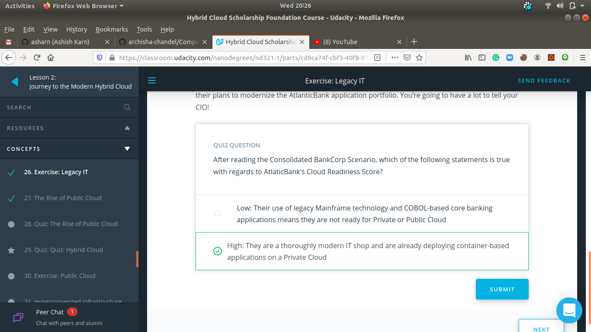
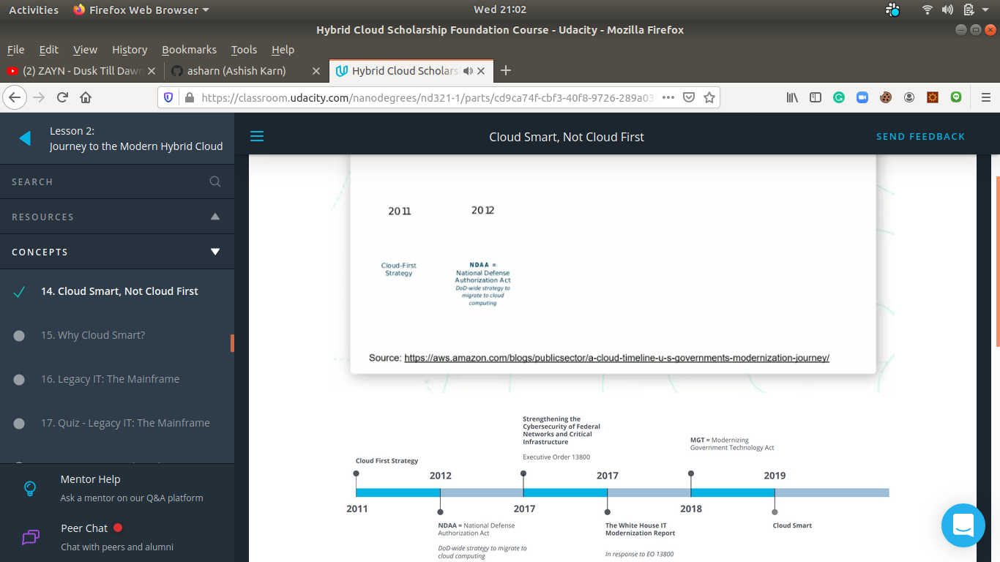

# 2.5-month-of-nutanix-hybrid-cloud-challenge
This repo contains all the information related to Nutanix® Hybrid Cloud Scholarship Program of Phase-I and if selected then of Phase-II as well.

## Day 15: July 8, 2020. #90DaysofUdacity
- My current progress is:\
  **2. Modern Private Cloud Infrastructure** (Progress 27%)
    - **Lesson 2. Journey to the Modern Cloud** (Progress 88%)
		- **Quiz: Hyperconverged Infrastructure (HCI)**
		- *Exercise: Hyperconverged Infrastructure (HCI)**

## Day 14: July 6, 2020. #90DaysofUdacity
- My current progress is:\
  **2. Modern Private Cloud Infrastructure** (Progress 25%)
    - **Lesson 2. Journey to the Modern Cloud** (Progress 78%)
		- **Hyperconverged Infrastructure (HCI)**
			Hyperconverged Infrastructure (HCI) converges the entire datacenter stack, including compute, storage, networking, and virtualization. Some key points to remember about HCI are:

				- Software running on each server node distributes all operating functions across a cluster. This allows incremental scaling, so that a cluster can be grown one node at a time; performance increases as the environment grows.
				- The software also creates clusters and pools local storage, eliminating the need for SAN or NAS infrastructure​.
				- The removal of the physical storage fully unleashes the power of the SDDC.
				- The use of solid state drives (SSDs), combined with data locality, provides excellent cluster performance without bottlenecks.

## Day 13: July 5, 2020. #90DaysofUdacity
- My current progress is:\
  **2. Modern Private Cloud Infrastructure** (Progress 24%)
    - **Lesson 2. Journey to the Modern Cloud** (Progress 75%)
		- **Exercise: Public Cloud**
		- **Quiz: The Rise of Public Cloud**
		- **Quiz: Hybrid Cloud**

## Day 12: July 4, 2020. #90DaysofUdacity
- My current progress is:\
  **2. Modern Private Cloud Infrastructure** (Progress 22%)
    - **Lesson 2. Journey to the Modern Cloud** (Progress 68%)
		- **Exercise: Legacy IT**
		- **The Rise of Public Cloud**

## Day 11: July 3, 2020. #90DaysofUdacity
- My current progress is:\
  **2. Modern Private Cloud Infrastructure** (Progress 21%)
    - **Lesson 2. Journey to the Modern Cloud** (Progress 65%)
		- **Legacy IT: Hybrid Cloud Readiness**
		- **Legacy IT: The Software Defined Datacenter (SDDC)**

## Day 10: July 2, 2020. #90DaysofUdacity
- My current progress is:\
  **2. Modern Private Cloud Infrastructure** (Progress 20%)
    - **Lesson 2. Journey to the Modern Cloud** (Progress 60%)
		- **Legacy IT: Centralized Storage and 3-tier**
			Advantage and Disadvantage of Centralized Storage and 3-tier
			
		- **Legacy IT: x86 Virtualization**
		

## Day 9: July 1, 2020. #90DaysofUdacity
- My current progress is:\
  **2. Modern Private Cloud Infrastructure** (Progress 17%)
    - **Lesson 2. Journey to the Modern Cloud** (Progress 50%)
		- **Legacy of IT: The Mainframe**
			Advantage and Disadvantage of Mainframe Machine
		- **Legacy of IT: Distributed Computing**

## Day 8: June 30, 2020. #90DaysofUdacity
- My current progress is:\
  **2. Modern Private Cloud Infrastructure** (Progress 13%)
    - **Lesson 2. Journey to the Modern Cloud** (Progress 38%)
		- **Cloud Smart, Not Cloud First**
			Cloud Smart is about rationalizing applications, infrastructure, skills, and people across hybrid clouds and ensuring everything is where it fits best.
		- **Why Cloud Smart?**

## Day 7: June 29, 2020. #90DaysofUdacity
- My current progress is:\
  **2. Modern Private Cloud Infrastructure** (Progress 13%)
    - **Lesson 2. Journey to the Modern Cloud** (Progress 35%)
		- **Organizational Readiness Fundamentals**
			Organizational readiness refers to how ready a business is to execute their cloud transformation plan successfully.
		- **What is Cloud Readiness?**

## Day 6: June 28, 2020. #90DaysofUdacity
- My current progress is:\
  **2. Modern Private Cloud Infrastructure** (Progress 12%)
    - **Lesson 2. Journey to the Modern Cloud** (Progress 33%)
		- **Cloud Considerations**
		- **Cloud Considerations: Workload Predictability**

## Day 5: June 27, 2020. #90DaysofUdacity
- My current progress is:\
  **2. Modern Private Cloud Infrastructure** (Progress 10%)
    - **Lesson 2. Journey to the Modern Cloud** (Progress 25%)
		- **Application Design: Distributed Web Scale**
			3-tier Web Application\
			
		- **What differentiates the organizations that use it from the organizations that do not? Why is the cloud so important?**

## Day 4: June 26, 2020. #90DaysofUdacity
- My current progress is:
  **2. Modern Private Cloud Infrastructure** (Progress 8%)
    - **Lesson 2. Journey to the Modern Cloud** (Progress 20%)
		- **Understanding the Cloud**
			- The Cloud is an Experience and a Mindset
			 
			- Service Models
			
		- **Application Design: The Monolith**\
			When we refer to monolithic, we mean there is one, single source of every component in the stack. 

		

## Day 3: June 25, 2020. #90DaysofUdacity
- My current progress is:\
  **2. Modern Private Cloud Infrastructure** (Progress 7%)\
	In this lesson, we’re going to cover:
	1. What the role of a Hybrid Cloud Engineer is
    2. The different models to support various Cloud initiatives
    3. The Engineer’s role in Service Level Agreements related to Cloud apps
	4. How to choose the optimal Cloud platform for an app, based on business requirements and SLAs

    - **Lesson 2. Journey to the Modern Cloud** (Progress 15%)
		- **Why are Hybrid Cloud Engineers needed?**
		- **What does a Hybrid Cloud Engineer do?**
			A hybrid cloud engineer can design, create, operate, and manage different types of workloads across multiple clouds and infrastructure providers.
		- **Digital Transformation**
			The need for complex and specialized silos for data center infrastructure was removed by public cloud providers through the commoditization of the IT industry. This is called digital transformation (or DX) in the industry and refers to traditional IT practices making the effort necessary to modernize. Naturally, this takes a lot of time and resources. 
		

## Day 2: June 24, 2020. #90DaysofUdacity
- My current progress is:\
  **Lesson 1. Introduction to the Nutanix Hybrid Cloud** (Progress 100%)
    - **Meet Your Instructor: Cees Eijk**
	- **Prerequisites**
		In order to take this course, you should be comfortable with command line on Linux or Windows. It would also be helpful for you to have a background in working with VMs as well as AWS or GCP cloud.
	- **Course Outline**
		In this course, we're going to cover:\
			1. The Journey to the Modern Hybrid Cloud\
            2. Introduce you to the Nutanix HCI\
			3. Hybrid Cloud Security\
			4. Networking\
			5. Managing Virtual Machines in the Hybrid Cloud\
			6. Data Protection

## Day 1: June 23, 2020. #90DaysofUdacity
- My current progress is:\
  **Part 1. Welcome to the Nutanix Hybrid Cloud Foundation Course** (Progress 100%)
    I have gathered idea about this program and joined slack community to learn and collaborate together.
    ### Welcome and Congratulations!
     Udacity and Nutanix are excited to welcome you to the Nutanix Hybrid Cloud Scholarship Phase 1 (Modern Private Cloud Infrastructure). Here are some helpful   details as you start the program.

    ### How the Scholarship Foundation works:
     The lessons in this Foundation course have been specially designed to prepare you to take the full Hybrid Cloud Nanodegree program. We recommend you take the time to go through the carefully prepared lessons, as course completion is required to qualify for a Nanodegree scholarship. If you have questions, we encourage you to ask directly in our student community.

